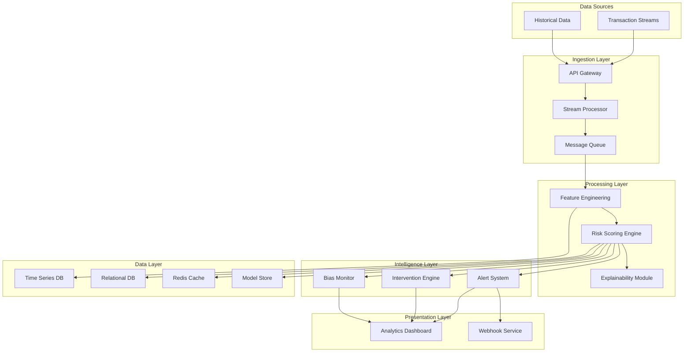

# Design Document: Credora Financial Distress Prediction Platform

## Overview

Credora is an AI-powered financial pre-delinquency prediction platform that analyzes real-time transaction behavior to predict financial distress 2-4 weeks before missed payments occur. The system combines streaming data ingestion, behavioral feature engineering, machine learning risk scoring, and proactive intervention recommendations to help financial institutions reduce delinquency rates.

### Design Goals

- **Real-time Processing**: Ingest and analyze transactions within seconds of occurrence
- **Predictive Accuracy**: Achieve 85%+ accuracy in 2-4 week prediction window
- **Explainability**: Provide clear, actionable insights for non-technical users
- **Scalability**: Support millions of customers with high transaction volumes
- **Fairness**: Monitor and mitigate algorithmic bias across demographic segments
- **Security**: Protect sensitive financial data with enterprise-grade security

### Key Design Principles

1. **Event-Driven Architecture**: Use streaming data pipelines for real-time responsiveness
2. **Microservices**: Decompose system into independently scalable components
3. **ML Ops Integration**: Continuous model monitoring, retraining, and deployment
4. **API-First**: All components expose well-defined REST APIs
5. **Privacy by Design**: Implement data minimization and encryption throughout


## Architecture

### High-Level System Architecture



### Component Overview

**Ingestion Layer**
- API Gateway: Entry point for transaction data, handles authentication and rate limiting
- Stream Processor: Real-time event processing using Apache Kafka or AWS Kinesis
- Message Queue: Decouples ingestion from processing for reliability

**Processing Layer**
- Feature Engineering: Extracts behavioral signals from raw transactions
- Risk Scoring Engine: ML model that calculates financial distress probability
- Explainability Module: Generates human-readable prediction explanations

**Intelligence Layer**
- Alert System: Generates and routes early warning notifications
- Intervention Engine: Recommends proactive actions based on risk factors
- Bias Monitor: Tracks model fairness and performance drift

**Presentation Layer**
- Analytics Dashboard: Web UI for viewing customer analytics and trends
- Webhook Service: Delivers alerts to external systems via HTTP callbacks

**Data Layer**
- Time Series DB: Stores transaction history and behavioral signals (InfluxDB/TimescaleDB)
- Relational DB: Stores customer profiles, risk scores, alerts (PostgreSQL)
- Cache: High-speed access to recent risk scores (Redis)
- Model Store: Versioned ML models and metadata (MLflow)


## Components and Interfaces

### 1. Transaction Monitor (Ingestion Layer)

**Responsibilities**
- Receive transaction events from multiple sources (REST API, streaming)
- Validate and sanitize incoming data
- Anonymize PII before storage
- Maintain rolling 90-day transaction history per customer
- Handle malformed data gracefully

**Interface**

```typescript
interface TransactionMonitor {
  // Ingest single transaction
  ingestTransaction(transaction: Transaction): Promise<IngestResult>
  
  // Batch ingest for historical data
  ingestBatch(transactions: Transaction[]): Promise<BatchIngestResult>
  
  // Query transaction history
  getTransactionHistory(customerId: string, days: number): Promise<Transaction[]>
}

interface Transaction {
  transactionId: string
  customerId: string
  timestamp: Date
  amount: number
  category: TransactionCategory
  merchantId?: string
  status: 'completed' | 'failed' | 'pending'
}

enum TransactionCategory {
  SALARY = 'salary',
  SAVINGS = 'savings',
  UTILITY = 'utility',
  LENDING_APP = 'lending_app',
  ATM_WITHDRAWAL = 'atm_withdrawal',
  AUTO_DEBIT = 'auto_debit',
  OTHER = 'other'
}

interface IngestResult {
  success: boolean
  transactionId: string
  processingTimeMs: number
  errors?: string[]
}
```

**Data Flow**
1. Transaction arrives via REST API or Kafka stream
2. API Gateway validates authentication and rate limits
3. Stream Processor validates schema and enriches with metadata
4. Transaction published to message queue
5. Feature Engineering service consumes from queue
6. Transaction stored in Time Series DB with encryption

**Performance Targets**
- Ingestion latency: < 5 seconds (p95)
- Throughput: 10,000 transactions/second
- Data loss: < 0.01%

### 2. Feature Engineering Service

**Responsibilities**
- Extract behavioral signals from transaction streams
- Calculate rolling window aggregations (7-day, 30-day, 90-day)
- Detect anomalies and pattern changes
- Prepare feature vectors for ML model

**Behavioral Signals Extracted**

```typescript
interface BehavioralSignals {
  customerId: string
  timestamp: Date
  
  // Salary signals
  salaryDelayDays: number
  salaryAmountChange: number
  salaryFrequencyChange: boolean
  
  // Savings signals
  savingsBalance: number
  savingsDeclineRate: number  // % per week
  savingsVolatility: number
  
  // Utility payment signals
  utilityPaymentDelay: number
  utilityPaymentMissed: boolean
  utilityPaymentAmountChange: number
  
  // Lending app signals
  lendingAppTransactionCount: number
  lendingAppTransactionIncrease: number  // % change
  newLendingAppUsage: boolean
  
  // ATM withdrawal signals
  atmWithdrawalFrequency: number
  atmWithdrawalSpike: boolean
  atmWithdrawalAmountChange: number
  
  // Auto-debit signals
  autoDebitFailureCount: number
  autoDebitFailureRate: number
  criticalAutoDebitFailed: boolean
}
```

**Feature Engineering Pipeline**

```python
class FeatureEngineer:
    def extract_features(self, customer_id: str, window_days: int = 90) -> BehavioralSignals:
        """
        Extract behavioral signals from transaction history
        
        Args:
            customer_id: Customer identifier
            window_days: Historical window for feature calculation
            
        Returns:
            BehavioralSignals object with all computed features
        """
        transactions = self.get_transactions(customer_id, window_days)
        
        signals = BehavioralSignals()
        signals.customerId = customer_id
        signals.timestamp = datetime.now()
        
        # Calculate each signal category
        signals.update(self._extract_salary_signals(transactions))
        signals.update(self._extract_savings_signals(transactions))
        signals.update(self._extract_utility_signals(transactions))
        signals.update(self._extract_lending_signals(transactions))
        signals.update(self._extract_atm_signals(transactions))
        signals.update(self._extract_autodebit_signals(transactions))
        
        return signals
    
    def _extract_salary_signals(self, transactions: List[Transaction]) -> dict:
        """Calculate salary-related behavioral signals"""
        salary_txns = [t for t in transactions if t.category == 'salary']
        
        if len(salary_txns) < 2:
            return default_salary_signals()
        
        # Calculate expected salary date based on historical pattern
        expected_date = self._calculate_expected_salary_date(salary_txns)
        actual_date = salary_txns[-1].timestamp
        delay_days = (actual_date - expected_date).days
        
        # Calculate amount change
        recent_amount = salary_txns[-1].amount
        avg_amount = mean([t.amount for t in salary_txns[:-1]])
        amount_change = (recent_amount - avg_amount) / avg_amount
        
        return {
            'salaryDelayDays': max(0, delay_days),
            'salaryAmountChange': amount_change,
            'salaryFrequencyChange': self._detect_frequency_change(salary_txns)
        }
```

**Performance Targets**
- Feature extraction latency: < 2 seconds per customer
- Feature freshness: Updated within 5 minutes of new transaction


### 3. Risk Scoring Engine (AI Model)

**Responsibilities**
- Calculate financial distress probability (0-100 risk score)
- Generate predictions for 2-4 week window
- Update scores daily for all active customers
- Handle insufficient data scenarios gracefully

**Model Architecture**

The Risk Scoring Engine uses a gradient boosting model (XGBoost/LightGBM) trained on historical transaction data and payment outcomes.

```python
class RiskScoringEngine:
    def __init__(self, model_path: str):
        self.model = self._load_model(model_path)
        self.feature_engineer = FeatureEngineer()
        self.explainer = SHAPExplainer(self.model)
    
    def calculate_risk_score(self, customer_id: str) -> RiskScoreResult:
        """
        Calculate financial distress risk score for a customer
        
        Args:
            customer_id: Customer identifier
            
        Returns:
            RiskScoreResult with score, confidence, and explanation
        """
        # Extract behavioral features
        features = self.feature_engineer.extract_features(customer_id)
        
        # Check if sufficient data available
        if not self._has_sufficient_data(features):
            return RiskScoreResult(
                customerId=customer_id,
                riskScore=None,
                confidence=None,
                explanation="Insufficient transaction history (< 30 days required)",
                predictionWindow=None
            )
        
        # Prepare feature vector
        feature_vector = self._prepare_features(features)
        
        # Generate prediction
        probability = self.model.predict_proba(feature_vector)[0][1]
        risk_score = int(probability * 100)
        
        # Calculate confidence interval
        confidence = self._calculate_confidence(feature_vector)
        
        # Generate explanation
        explanation = self.explainer.explain(feature_vector, features)
        
        return RiskScoreResult(
            customerId=customer_id,
            riskScore=risk_score,
            confidence=confidence,
            explanation=explanation,
            predictionWindow=(14, 28),  # 2-4 weeks
            timestamp=datetime.now()
        )
    
    def batch_score(self, customer_ids: List[str]) -> List[RiskScoreResult]:
        """Batch scoring for efficiency"""
        return [self.calculate_risk_score(cid) for cid in customer_ids]
```

**Model Training Pipeline**

```python
class ModelTrainer:
    def train_model(self, training_data: pd.DataFrame) -> Model:
        """
        Train risk scoring model on historical data
        
        Training data includes:
        - Behavioral signals (features)
        - Payment outcomes (labels): 0 = paid on time, 1 = missed payment
        - Temporal split: Train on months 1-10, validate on month 11, test on month 12
        """
        X_train, y_train = self._prepare_training_data(training_data)
        
        # Handle class imbalance with SMOTE
        X_resampled, y_resampled = SMOTE().fit_resample(X_train, y_train)
        
        # Train gradient boosting model
        model = LGBMClassifier(
            n_estimators=500,
            learning_rate=0.05,
            max_depth=7,
            num_leaves=31,
            min_child_samples=20,
            subsample=0.8,
            colsample_bytree=0.8,
            random_state=42
        )
        
        model.fit(X_resampled, y_resampled)
        
        # Validate model
        metrics = self._validate_model(model, X_val, y_val)
        
        return model, metrics
```

**Model Features (Input)**
- All behavioral signals from Feature Engineering (20+ features)
- Temporal features: day of week, day of month, month of year
- Customer tenure and account age
- Historical payment behavior (if available)

**Model Output**

```typescript
interface RiskScoreResult {
  customerId: string
  riskScore: number | null  // 0-100, null if insufficient data
  confidence: ConfidenceInterval
  explanation: ExplainabilityOutput
  predictionWindow: [number, number]  // [min_days, max_days]
  timestamp: Date
}

interface ConfidenceInterval {
  lower: number  // Lower bound of 95% CI
  upper: number  // Upper bound of 95% CI
}
```

**Performance Targets**
- Prediction accuracy: > 85% (F1 score)
- Scoring latency: < 10 seconds per customer
- Batch scoring: 1M customers in < 24 hours
- Model refresh: Weekly retraining on new data


### 4. Explainability Module

**Responsibilities**
- Generate human-readable explanations for risk scores
- Identify top contributing factors
- Calculate feature importance percentages
- Highlight changes in risk drivers

**Implementation**

Uses SHAP (SHapley Additive exPlanations) for model-agnostic explanations.

```python
class SHAPExplainer:
    def __init__(self, model):
        self.model = model
        self.explainer = shap.TreeExplainer(model)
    
    def explain(self, feature_vector: np.ndarray, features: BehavioralSignals) -> ExplainabilityOutput:
        """
        Generate explanation for a risk score prediction
        
        Args:
            feature_vector: Numerical feature array used for prediction
            features: Original behavioral signals with semantic names
            
        Returns:
            ExplainabilityOutput with top factors and importance scores
        """
        # Calculate SHAP values
        shap_values = self.explainer.shap_values(feature_vector)
        
        # Get top 5 contributing features
        feature_importance = np.abs(shap_values[0])
        top_indices = np.argsort(feature_importance)[-5:][::-1]
        
        # Map to human-readable descriptions
        factors = []
        total_importance = np.sum(feature_importance[top_indices])
        
        for idx in top_indices:
            factor = ContributingFactor(
                name=self._get_feature_name(idx),
                description=self._get_human_description(idx, features),
                importance=float(feature_importance[idx] / total_importance * 100),
                direction='increases' if shap_values[0][idx] > 0 else 'decreases'
            )
            factors.append(factor)
        
        return ExplainabilityOutput(
            topFactors=factors,
            timestamp=datetime.now()
        )
    
    def _get_human_description(self, feature_idx: int, features: BehavioralSignals) -> str:
        """Convert feature to plain language description"""
        feature_name = self.feature_names[feature_idx]
        
        descriptions = {
            'salaryDelayDays': f"Salary delayed by {features.salaryDelayDays} days",
            'savingsDeclineRate': f"Savings declining at {features.savingsDeclineRate:.1f}% per week",
            'lendingAppTransactionIncrease': f"Lending app usage increased by {features.lendingAppTransactionIncrease:.0f}%",
            'autoDebitFailureCount': f"{features.autoDebitFailureCount} auto-debit failures in past 30 days",
            'atmWithdrawalSpike': "Unusual spike in ATM withdrawals",
            'utilityPaymentDelay': f"Utility payment delayed by {features.utilityPaymentDelay} days"
        }
        
        return descriptions.get(feature_name, f"Change in {feature_name}")
```

**Output Format**

```typescript
interface ExplainabilityOutput {
  topFactors: ContributingFactor[]
  timestamp: Date
}

interface ContributingFactor {
  name: string  // Technical feature name
  description: string  // Plain language description
  importance: number  // Percentage contribution (0-100)
  direction: 'increases' | 'decreases'  // Impact on risk
}
```

**Example Output**

```json
{
  "topFactors": [
    {
      "name": "salaryDelayDays",
      "description": "Salary delayed by 12 days",
      "importance": 35.2,
      "direction": "increases"
    },
    {
      "name": "savingsDeclineRate",
      "description": "Savings declining at 8.5% per week",
      "importance": 28.7,
      "direction": "increases"
    },
    {
      "name": "lendingAppTransactionIncrease",
      "description": "Lending app usage increased by 150%",
      "importance": 18.3,
      "direction": "increases"
    },
    {
      "name": "autoDebitFailureCount",
      "description": "3 auto-debit failures in past 30 days",
      "importance": 12.1,
      "direction": "increases"
    },
    {
      "name": "atmWithdrawalSpike",
      "description": "Unusual spike in ATM withdrawals",
      "importance": 5.7,
      "direction": "increases"
    }
  ]
}
```


### 5. Alert System

**Responsibilities**
- Monitor risk score changes
- Generate prioritized alerts based on thresholds
- Deliver alerts through multiple channels
- Prevent alert fatigue with deduplication

**Alert Generation Logic**

```python
class AlertSystem:
    def __init__(self):
        self.alert_store = AlertStore()
        self.notification_service = NotificationService()
    
    def process_risk_score(self, risk_result: RiskScoreResult):
        """
        Process risk score and generate alerts if needed
        
        Args:
            risk_result: Risk score calculation result
        """
        customer_id = risk_result.customerId
        risk_score = risk_result.riskScore
        
        if risk_score is None:
            return  # No alert for insufficient data
        
        # Determine alert priority
        priority = self._determine_priority(risk_score)
        
        if priority is None:
            return  # Score below alert threshold
        
        # Check for recent alerts (deduplication)
        recent_alert = self.alert_store.get_recent_alert(customer_id, hours=24)
        
        if recent_alert:
            # Only send new alert if score increased significantly
            if risk_score < recent_alert.riskScore + 10:
                return
        
        # Create alert
        alert = Alert(
            alertId=generate_uuid(),
            customerId=customer_id,
            riskScore=risk_score,
            priority=priority,
            explanation=risk_result.explanation,
            predictionWindow=risk_result.predictionWindow,
            timestamp=datetime.now()
        )
        
        # Store alert
        self.alert_store.save(alert)
        
        # Deliver alert
        self._deliver_alert(alert, priority)
    
    def _determine_priority(self, risk_score: int) -> str | None:
        """Determine alert priority based on risk score"""
        if risk_score >= 70:
            return 'high'
        elif risk_score >= 50:
            return 'medium'
        else:
            return None  # No alert
    
    def _deliver_alert(self, alert: Alert, priority: str):
        """Deliver alert through configured channels"""
        # High priority: immediate delivery
        if priority == 'high':
            self.notification_service.send_email(alert, urgent=True)
            self.notification_service.send_sms(alert)
            self.notification_service.send_webhook(alert)
            # Target: < 1 minute delivery
        
        # Medium priority: standard delivery
        elif priority == 'medium':
            self.notification_service.send_email(alert, urgent=False)
            self.notification_service.send_webhook(alert)
            # Target: < 5 minutes delivery
```

**Alert Data Model**

```typescript
interface Alert {
  alertId: string
  customerId: string
  riskScore: number
  priority: 'high' | 'medium'
  explanation: ExplainabilityOutput
  predictionWindow: [number, number]
  timestamp: Date
  status: 'sent' | 'acknowledged' | 'resolved'
  assignedTo?: string  // User ID of assigned relationship manager
}
```

**Notification Channels**

```python
class NotificationService:
    def send_email(self, alert: Alert, urgent: bool):
        """Send email notification"""
        subject = f"{'URGENT: ' if urgent else ''}High Risk Alert - Customer {alert.customerId}"
        body = self._format_email_body(alert)
        
        recipients = self._get_recipients(alert.priority)
        
        for recipient in recipients:
            self.email_client.send(
                to=recipient,
                subject=subject,
                body=body,
                priority='high' if urgent else 'normal'
            )
    
    def send_sms(self, alert: Alert):
        """Send SMS for high-priority alerts"""
        message = f"URGENT: Customer {alert.customerId} risk score {alert.riskScore}. Check dashboard."
        
        on_call_managers = self._get_on_call_managers()
        
        for manager in on_call_managers:
            self.sms_client.send(manager.phone, message)
    
    def send_webhook(self, alert: Alert):
        """Send webhook to external systems"""
        payload = {
            'event': 'risk_alert',
            'alert': alert.to_dict(),
            'timestamp': datetime.now().isoformat()
        }
        
        webhook_urls = self._get_configured_webhooks()
        
        for url in webhook_urls:
            self.http_client.post(url, json=payload, timeout=5)
```

**Performance Targets**
- High-priority alert delivery: < 1 minute
- Medium-priority alert delivery: < 5 minutes
- Alert delivery success rate: > 99.5%


### 6. Intervention Engine

**Responsibilities**
- Generate actionable intervention recommendations
- Rank recommendations by expected impact
- Tailor recommendations to dominant risk factors
- Track intervention outcomes

**Recommendation Logic**

```python
class InterventionEngine:
    def __init__(self):
        self.recommendation_rules = self._load_recommendation_rules()
        self.impact_model = self._load_impact_model()
    
    def generate_recommendations(self, risk_result: RiskScoreResult) -> List[Intervention]:
        """
        Generate ranked intervention recommendations
        
        Args:
            risk_result: Risk score result with explanation
            
        Returns:
            List of ranked intervention recommendations
        """
        if risk_result.riskScore < 50:
            return []  # No interventions needed for low risk
        
        # Extract dominant risk factors
        top_factors = risk_result.explanation.topFactors[:3]
        
        # Generate candidate interventions
        candidates = []
        for factor in top_factors:
            interventions = self._get_interventions_for_factor(factor)
            candidates.extend(interventions)
        
        # Rank by expected impact
        ranked = self._rank_by_impact(candidates, risk_result)
        
        # Return top 3-5 recommendations
        return ranked[:5]
    
    def _get_interventions_for_factor(self, factor: ContributingFactor) -> List[Intervention]:
        """Map risk factors to intervention strategies"""
        
        # Salary delay interventions
        if 'salary' in factor.name.lower():
            return [
                Intervention(
                    type='payment_plan',
                    title='Restructure Payment Schedule',
                    description='Align payment due dates with expected salary date',
                    expectedImpact=0.35,
                    effort='medium',
                    timeline='1-2 weeks'
                ),
                Intervention(
                    type='grace_period',
                    title='Extend Grace Period',
                    description='Provide 15-day grace period for next payment',
                    expectedImpact=0.28,
                    effort='low',
                    timeline='immediate'
                )
            ]
        
        # Savings decline interventions
        elif 'savings' in factor.name.lower():
            return [
                Intervention(
                    type='financial_counseling',
                    title='Financial Wellness Counseling',
                    description='Connect customer with financial advisor for budgeting support',
                    expectedImpact=0.42,
                    effort='medium',
                    timeline='2-4 weeks'
                ),
                Intervention(
                    type='savings_plan',
                    title='Automated Savings Plan',
                    description='Set up micro-savings program to rebuild emergency fund',
                    expectedImpact=0.31,
                    effort='low',
                    timeline='1 week'
                )
            ]
        
        # Lending app usage in